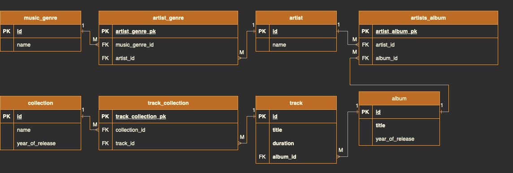

# Проект базы данных музыкального сервиса 
*Пример работы с PostgreSQL* 

## Создание таблиц и связей между ними:
### Таблицы:

1. Список музыкальных жанров. У каждого жанра есть название и ID.
2. Список исполнителей. У исполнителя есть ID, имя (псевдоним) и жанр, в котором он исполняет.
3. Список альбомов исполнителей. У альбома есть название, ID, год выпуска и его исполнитель.
4. Список музыкальных треков. У трека есть название, ID,  длительность и альбом, которому этот трек принадлежит.
5. Сборник. Сборник имеет название, ID и год выпуска.

### Связи:

- Для каждого жанра можно получить список исполнителей, которые исполняют в соответствующем жанре.
- Для каждого исполнителя можно получить список его альбомов.
- Для каждого альбома можно получить список треков, которые в него входят.
- Исполнители могут петь в разных жанрах, как и одному жанру могут принадлежать несколько исполнителей.
- Альбом могут выпустить несколько исполнителей вместе. Каждый исполнитель может принимать участие во множестве альбомов.
- Музыкальный трек принадлежит строго одному альбому.
- В сборник входят различные треки из разных альбомов.
- Один и тот же трек может присутствовать в разных сборниках.

### Схема таблиц и связей - 

### SQL-запросы, создающие спроектированную БД -[Create.sql](Create.sql)
### SQL-запросы, заполняющие БД данными - [Insert.sql](Insert.sql)
* исполнителей;
* жанров;
* альбомов;
* трек;
* сборников.

---

## SQL-запросы, выполненяющие Select-запросы [Select.sql](Select.sql):
### Запросы в файл состоят из двух подразноводностей: 
### *Для выборки из одной таблицы* (**Задание 2.1 - 2.5**):
1. название и продолжительность самого длительного трека;
2. название треков, продолжительность которых не менее 3,5 минуты;
3. названия сборников, вышедших в период с 2018 по 2020 год включительно;
4. исполнители, чье имя состоит из 1 слова;
5. название треков, которые содержат слово “мой” или “my”.

### *Для выборки из разных таблиц, которые выведут информацию согласно инструкциям ниже* (**Задание 3.1 - 4.5**): 
1. количество исполнителей в каждом жанре;
2. количество треков, вошедших в альбомы 2019-2020 годов;
3. средняя продолжительность треков по каждому альбому;
4. все исполнители, которые не выпустили альбомы в 2020 году;
5. названия сборников, в которых присутствует конкретный исполнитель (выберите сами);
6. название альбомов, в которых присутствуют исполнители более 1 жанра;
7. наименование треков, которые не входят в сборники;
8. Исполнитель или исполнители, написавшие самый короткий по продолжительности трек (теоретически таких треков может быть несколько);
9. название альбомов, содержащих наименьшее количество треков.
